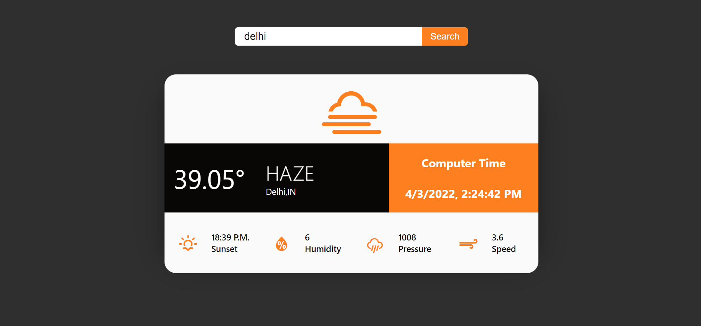

# WEATHER APP

## Table of Contents

- [Overview](#overview)
  - [The Description](#description)
  - [Screenshot](#screenshot)
  - [Link](#Link)
  - [Technical Skills](#technical-skills)
  - [Frameworks](#frameworks)
  - [Tools](#tools)
  - [Acknowledgements](#acknowledgements)
- [Author](#author)
  - [Connect With Me](#connect-with-me)
  - [Github Stats](#github-stats)

## Overview

### Description

It shows weather data, such as temperature, humidity, pressure, condition, speed of wind, country and sunset timing, of the city searched by the user.

### Screenshot

### Link

- Solution URL : [https://github.com/Anish010/Weather-App]
- Live Site URL : [https://weather-app-sigma-pied.vercel.app]

### Technical Skills

 

### Frameworks

 

### Tools

### Acknowledgements

- [API](https://openweathermap.org/current#name)
- [Icons](https://erikflowers.github.io/weather-icons/)
- [Fonts](https://fonts.google.com)

## Authors

### Connect With Me

 
 
### GitHub Stats

